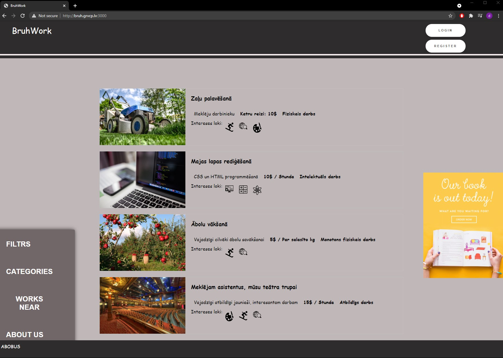

# EU Code Week Hackathon

## Basic information:

During 24 hours code session we have created solution, to help young people finding their first job. We were trying to create an aplication that would be very easy to understand for teenagers in age range from 15 to 19 years old, to this achive we were trying to negate plain text and insted use intuitive symbols.

## We were using:

- Node.js with express - as our web-server
- SQLite3 - for storing all information about users and posts
- Pure HTML/CSS/JS - for front-end

## Some examples:

## Latvia - #BruhTeam
